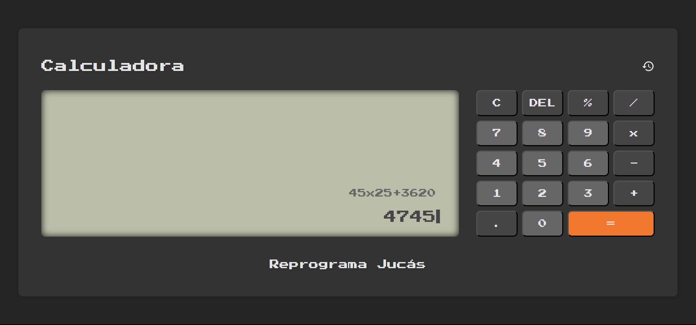

# Calculator

Este projeto foi desenvolvido na conclusão do módulo de JavaScript do curso de [Desenvolvimento Web](https://emanuelquintino.github.io/Page-WDC/). A Calculadora é uma aplicação que consegue resolver expressões com múltiplas operações e registrar seu hitórico.

## Tecnologias Utilizadas

- HTML
- CSS
- JavaScript

## Links

- [Deploy](https://emanuelquintino.github.io/Calculator/)
